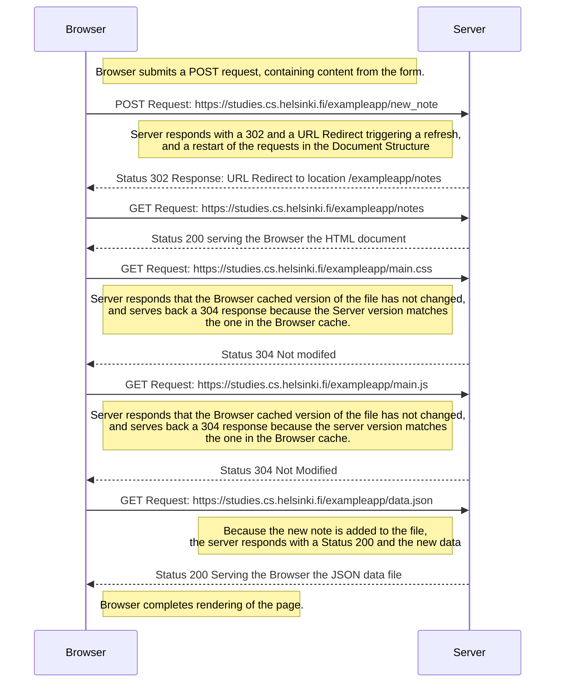

# The sequence of the new note form submission

```mermaid
sequenceDiagram
  participant Browser
  participant Server

  Note right of Browser: Browser submits a POST request, containing content from the form.
  Browser->>Server: POST Request: https://studies.cs.helsinki.fi/exampleapp/new_note
  Note left of Server: Server responds with a 302 and a URL Redirect triggering a refresh,<br/> and a restart of the requests in the Document Structure
  Server-->>Browser: Status 302 Response: URL Redirect to location /exampleapp/notes

  Browser->>Server: GET Request: https://studies.cs.helsinki.fi/exampleapp/notes
  Server-->>Browser: Status 200 serving the Browser the HTML document
  Browser->>Server: GET Request: https://studies.cs.helsinki.fi/exampleapp/main.css
  Note left of Server: Server responds that the Browser cached version of the file has not changed,<br/> and serves back a 304 response because the Server version matches<br/> the one in the Browser cache.
  Server-->>Browser: Status 304 Not modifed
  Browser->>Server: GET Request: https://studies.cs.helsinki.fi/exampleapp/main.js
  Note left of Server: Server responds that the Browser cached version of the file has not changed,<br/> and serves back a 304 response because the server version matches<br/> the one in the Browser cache.
  Server-->>Browser: Status 304 Not Modified
  Browser->>Server: GET Request: https://studies.cs.helsinki.fi/exampleapp/data.json
  Note left of Server: Because the new note is added to the file,<br/>the server responds with a Status 200 and the new data
  Server-->>Browser: Status 200 Serving the Browser the JSON data file
  Note right of Browser: Browser completes rendering of the page.

```
