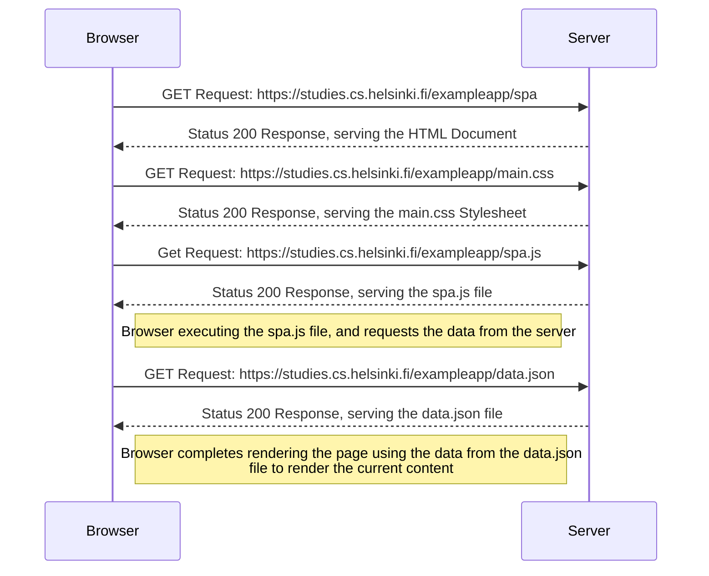

# Rendering of a Single Page Application (SPA) Diagram

```mermaid
sequenceDiagram
  participant Browser
  participant Server

  Browser->>Server: GET Request: https://studies.cs.helsinki.fi/exampleapp/spa
  Server-->>Browser: Status 200 Response, serving the HTML Document
  Browser->>Server: GET Request: https://studies.cs.helsinki.fi/exampleapp/main.css
  Server-->>Browser: Status 200 Response, serving the main.css Stylesheet
  Browser->>Server: Get Request: https://studies.cs.helsinki.fi/exampleapp/spa.js
  Server-->>Browser: Status 200 Response, serving the spa.js file
  Note right of Browser: Browser executing the spa.js file, and requests the data from the server
  Browser->>Server: GET Request: https://studies.cs.helsinki.fi/exampleapp/data.json
  Server-->>Browser: Status 200 Response, serving the data.json file
  Note right of Browser: Browser completes rendering the page using the data from the data.json<br/> file to render the current content
```
