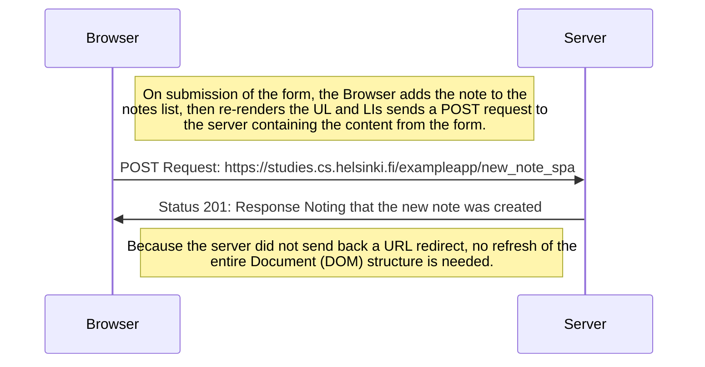

# Sequence of submitting a form in an SPA

```mermaid
sequenceDiagram
  participant Browser
  participant Server

  Note right of Browser: On submission of the form, the Browser adds the note to the <br/> notes list, then re-renders the UL and LIs sends a POST request to<br/> the server containing the content from the form.
  Browser->>Server: POST Request: https://studies.cs.helsinki.fi/exampleapp/new_note_spa
  Server->>Browser: Status 201: Response Noting that the new note was created
  Note left of Server: Because the server did not send back a URL redirect, no refresh of the <br/>entire Document (DOM) structure is needed.
```
